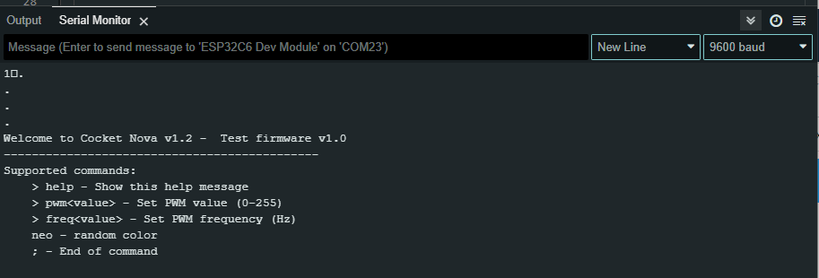
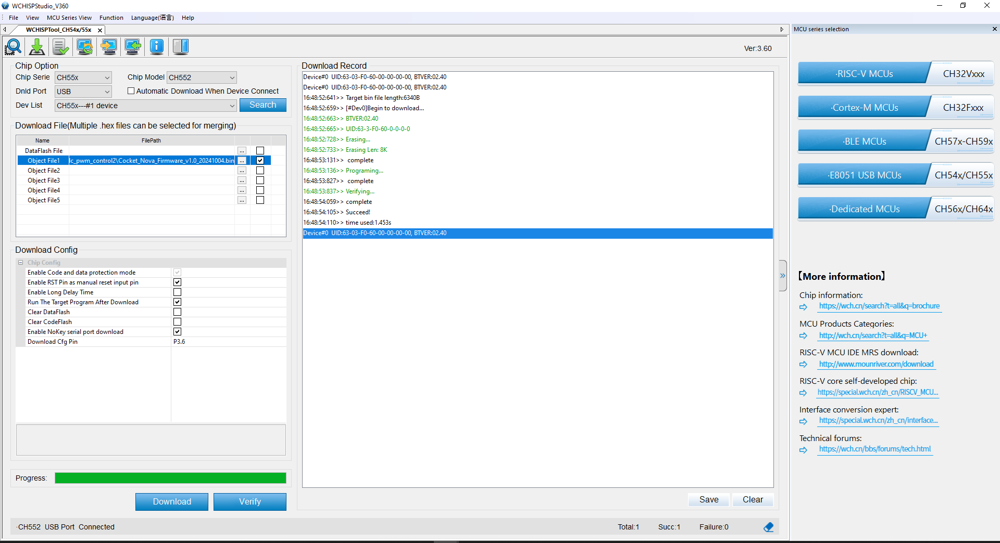

# Cocket Nova v1.2 - Test Firmware

## Description

This firmware is intended for testing on the Cocket Nova v1.2 board. It is a straightforward firmware that enables the control of the Red LED on the board through PWM. It is also possible to configure the PWM frequency in the firmware. The firmware also includes a command that can be used to set the WS2812 LED to a random color.

## Usage

- **Serial Interface**: 
  - Baud Rate: 9600 
  - Data Bits: 8 
  - Stop Bit: 1 
  - No parity

    

## Load Firmware

The Cocket Nova v1.2 board must be connected to your computer via USB in order to load the firmware. The firmware may be loaded by employing the subsequent command:

- [WCHISPTool_Setup_exe (Official)](https://www.wch-ic.com/downloads/WCHISPTool_Setup_exe.html)
- [WCHISPTool_Setup_exe (Local)](./wchtool/WCHISPTool_Setup_exe)

    

> **Note**: Ensure that the board is in bootloader mode prior to installing the firmware. Press the **BOOT** button and connect the USB cable to the board to enter bootloader mode.
